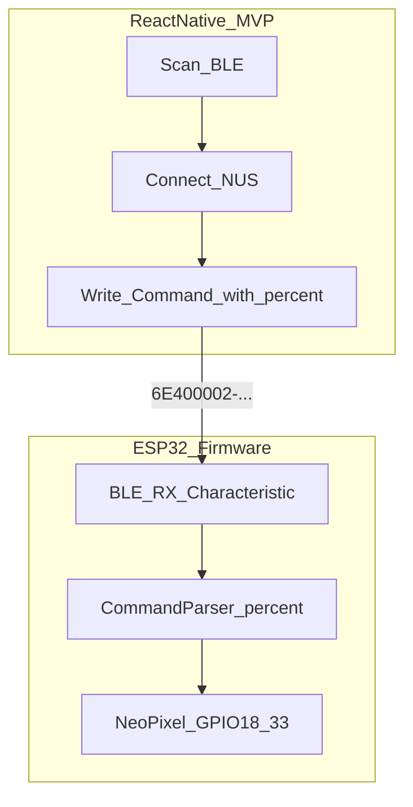

# ESP32 NeoPixel BLE 手機 App 規劃

## 現況與關鍵矛盾

| 項目   | 現況                                                                                       |
| ------ | ------------------------------------------------------------------------------------------ |
| 韌體   | [`src/esp32_bluetooth.ino`](src/esp32_bluetooth.ino) 使用 `BluetoothSerial`（Classic SPP） |
| 協定   | 指令以 `%` 結尾，支援 `stop%`、`mode1-5%`、`rainbow1/2%`、`rgbRRR,GGG,BBB,RRR,GGG,BBB%`    |
| 手機端 | [`mobile/`](mobile/) 已 scaffold RN 0.86.2，但 **僅預設模板**，尚未實作功能                |
| 依賴   | 已安裝 `react-native-ble-plx`（正確方向），但韌體仍是 Classic BT，**兩者目前無法互通**     |

你已選擇 **Android + iOS（BLE）** 與 **MVP：連線 + 送指令測試**，因此計畫分兩條線並行：**先改韌體、再做 App MVP**。



---

## 一、韌體：Classic SPP → BLE UART

### 目標

保留既有指令語意與解析邏輯，只替換傳輸層；App 與 README 的 `%` 協定不變。

### BLE 服務設計（Nordic UART Service，業界慣例）

| 項目                               | UUID / 值                                |
| ---------------------------------- | ---------------------------------------- |
| Service                            | `6E400001-B5A3-F393-E0A9-E50E24DCCA9E`   |
| RX（Central → ESP32，App 寫入）    | `6E400002-B5A3-F393-E0A9-E50E24DCCA9E`   |
| TX（ESP32 → Central，可選 notify） | `6E400003-B5A3-F393-E0A9-E50E24DCCA9E`   |
| 裝置名稱                           | `ESP32_BT`（維持 README 名稱，減少混淆） |

### 韌體修改重點（[`src/esp32_bluetooth.ino`](src/esp32_bluetooth.ino)）

1. **移除** `#include "BluetoothSerial.h"` 與 `SerialBT` 相關程式
2. **新增** `BLEDevice` / `BLEServer` / `BLECharacteristic`（ESP32 Arduino core 內建 BLE）
3. **RX Characteristic callback**：收到 bytes 後 append 到現有 `BT_String`，遇到 `%` 時觸發解析（沿用 `SerialBT_read()` 邏輯，可改名為 `appendBleChar()` + `parseIfComplete()`）
4. **`loop()`**：動畫模式（mode 2/3/5、rainbow）邏輯不變；BLE 資料在 callback 處理，避免 `delay()` 完全阻塞接收（現有行為與 README 一致）
5. **TX notify（MVP 可選）**：連線成功後回傳 `"OK\n"` 或 echo 已解析指令，方便 App debug log

### PlatformIO / 編譯

- [`platformio.ini`](platformio.ini) 維持 `framework = arduino`；Classic BT 改 BLE 後不再需要 Bluedroid Classic 設定
- 更新 [`README.md`](README.md)：
  - 連線方式改為 BLE（NUS UUID）
  - 註明 Classic SPP 已移除；iOS/Android 皆可連
  - 保留指令表不變

---

## 二、手機 App MVP 架構

### 技術選型（沿用現有 stack）

- **React Native 0.86.2** + **TypeScript**
- **react-native-ble-plx**：掃描、連線、寫 characteristic
- **zustand**：連線狀態、最近裝置、log
- **不引入 Navigation**（MVP 單一畫面即可；`@react-navigation/native` 保留供後續擴充）

### 目錄結構（新建）

```
mobile/src/
  constants/ble.ts          # NUS UUID、DEVICE_NAME
  services/BleService.ts    # BleManager 封裝
  store/useBleStore.ts      # 連線/device/log 狀態
  utils/commands.ts         # buildStop(), buildMode(n), buildRgb(...)
  screens/ControlScreen.tsx # MVP 主畫面
```

### BleService 職責

```typescript
// 概念流程（非最終程式碼）
manager.startDeviceScan(null, null, onDevice);
device.connect().then((d) => d.discoverAllServicesAndCharacteristics());
manager.writeCharacteristicWithResponseForDevice(
  deviceId,
  NUS_SERVICE,
  NUS_RX,
  base64Encode("stop%"),
);
```

- 掃描時以 `device.name === 'ESP32_BT'` 或 localName 過濾
- 連線後 `discoverAllServicesAndCharacteristics()`，驗證 NUS service 存在
- 送指令：UTF-8 → Base64（ble-plx 要求）
- 斷線/錯誤時更新 store 並允許重掃

### MVP UI（[`mobile/App.tsx`](mobile/App.tsx) → `ControlScreen`）

單屏布局，由上而下：

1. **狀態列**：Bluetooth 是否開啟、是否已連線、目前裝置名稱
2. **掃描區**：「開始掃描」/「停止掃描」、已發現裝置列表（點選即連線）
3. **快捷指令**（各按鈕直接送 `%` 結尾字串）：
   - `stop%`
   - `mode1%` … `mode5%`
   - `rainbow1%`、`rainbow2%`
4. **自訂指令**：TextInput +「送出」（方便測試 `rgb255,000,000,000,000,255%`）
5. **Log 區**：ScrollView 顯示 `[時間] 已送出: xxx`、`連線成功`、`錯誤: ...`

### 權限（已有基礎，微調即可）

- **Android** [`mobile/android/app/src/main/AndroidManifest.xml`](mobile/android/app/src/main/AndroidManifest.xml)：已有 `BLUETOOTH_SCAN` / `BLUETOOTH_CONNECT`；MVP 保留 `ACCESS_FINE_LOCATION`（部分舊機掃描 BLE 仍需）
- **iOS** [`mobile/ios/mobile/Info.plist`](mobile/ios/mobile/Info.plist)：已有 `NSBluetoothAlwaysUsageDescription`
- App 啟動時用 `PermissionsAndroid.requestMultiple` 請求 Android 權限（參考 ble-plx GETTING_STARTED）

### 不需在 MVP 做的項目（留待第二階段）

- 色盤 / RGB picker UI
- AsyncStorage 儲存常用配色
- 完整 Navigation 多頁
- 韌體 TX notify 的即時回饋 UI（可先只做寫入 log）

---

## 三、測試計畫

### 韌體

1. 燒錄後用 nRF Connect（iOS/Android）掃描 `ESP32_BT`
2. 連上 NUS RX，手動寫入 `mode1%`、`stop%`，確認兩條 NeoPixel 反應
3. 動畫模式中送 `stop%`，確認可中斷

### App MVP

1. Android 實機：掃描 → 連線 → 依序測 mode1-5、rainbow、rgb、stop
2. iOS 實機：同上（驗證 cross-platform）
3. 斷線重連、App 背景再回前景

---

## 四、風險與取捨

| 風險                 | 說明                                | 緩解                                                     |
| -------------------- | ----------------------------------- | -------------------------------------------------------- |
| 韌體 breaking change | 改 BLE 後，舊 SPP Serial App 無法連 | README 明確標註；必要時 git tag 保留 Classic 版          |
| BLE MTU              | 單次 write 有長度限制               | 最長指令 ~30 bytes，遠低於 MTU；若未來加長指令再實作分包 |
| 動畫延遲             | README 已述 delay 可能延遲切換      | MVP 不處理；第二階段可考慮縮短 delay 或非阻塞重構        |
| RN 0.86 + ble-plx    | 需確認相容                          | 專案已 pin `react-native-ble-plx@^3.5.1`，實機測試為準   |

---

## 五、建議實作順序

1. **韌體 BLE UART** + nRF Connect 驗證指令
2. **mobile/src 基礎層**（constants、commands、BleService、store）
3. **ControlScreen MVP UI** + 權限請求
4. **雙平台實機測試**
5. **更新根目錄 README**（BLE 連線說明、移除 Classic SPP 限制描述）

完成 MVP 後，第二階段可在你選的「完整 UI」範圍內加：雙色 color picker、預設場景、連線自動重試。
